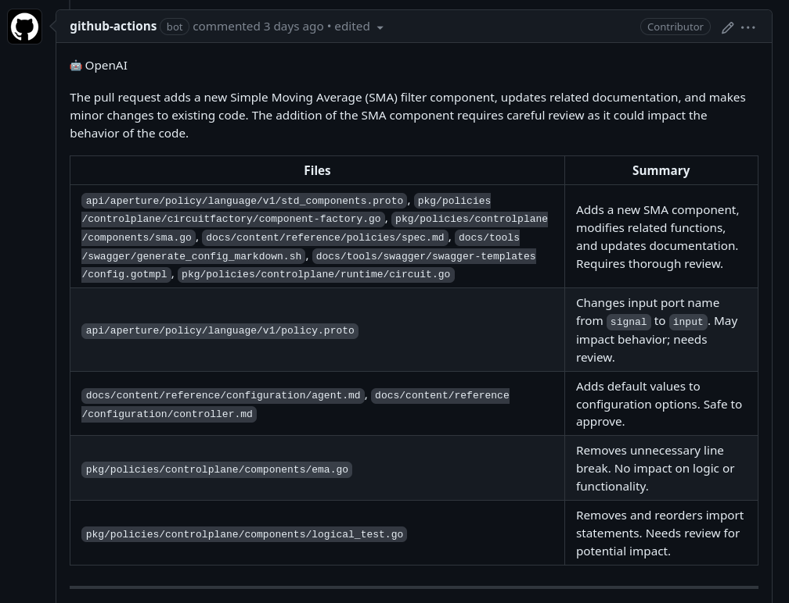
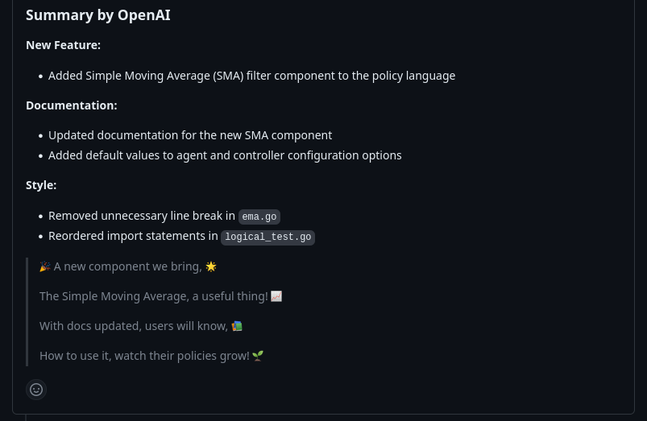

# OpenAI ChatGPT-based PR reviewer and summarizer


## Overview

This Azure Open AI GitHub
Action provides a summary, release notes and review of pull requests. The unique
features of this action are:

- **Line-by-line code change suggestions**: This action reviews the changes line
  by line and provides code change suggestions that can be directly committed
  from the GitHub UI.
- **Continuous, incremental reviews**: Reviews are performed on each commit
  within a pull request, rather than a one-time review on the entire pull
  request.
- **Smart review skipping**: By default, skips in-depth review for simple
  changes (e.g. typo fixes) and when changes look good for the most part. It can
  be disabled by setting `review_simple_changes` and `review_comment_lgtm` to
  `true`.
- **Customizable prompts**: Tailor the `system_message`, `summarize`, and
  `summarize_release_notes` prompts to focus on specific aspects of the review
  process or even change the review objective.


## Usage

Add the below file to your repository at
`.github/workflows/openai-pr-reviewer.yml` and fill `openai_light_model_url` (summary using GPT3.5) and `openai_heavy_model_url` (improve code using GPT4) using the provided Azure Open AI URL.
If you don't have access to GPT4, you can put the same URL for `openai_light_model_url` and `openai_heavy_model_url`, the suggested improvements will surely be worse.


```yaml
name: Code Review

permissions:
  contents: read
  pull-requests: write

on:
  pull_request:
  pull_request_review_comment:
    types: [created]

concurrency:
  group:
    ${{ github.repository }}-${{ github.event.number || github.head_ref ||
    github.sha }}-${{ github.workflow }}-${{ github.event_name ==
    'pull_request_review_comment' && 'pr_comment' || 'pr' }}
  cancel-in-progress: ${{ github.event_name != 'pull_request_review_comment' }}

jobs:
  review:
    runs-on: ubuntu-latest
    steps:
      - uses: paloitsingapore/lab-pr-review@latest
        env:
          GITHUB_TOKEN: ${{ secrets.GITHUB_TOKEN }}
          OPENAI_API_KEY: ${{ secrets.OPENAI_API_KEY }}
        with:
          debug: false
          review_simple_changes: false
          review_comment_lgtm: false
          openai_light_model_url:
          openai_heavy_model_url:
```

### Conversation with OpenAI

You can reply to a review comment made by this action and get a response based
on the diff context. Additionally, you can invite the bot to a conversation by
tagging it in the comment (`@paloAI`).

Example:

> @paloAI Please generate a test plan for this file.

Note: A review comment is a comment made on a diff or a file in the pull
request.

### Ignoring PRs

Sometimes it is useful to ignore a PR. For example, if you are using this action
to review documentation, you can ignore PRs that only change the documentation.
To ignore a PR, add the following keyword in the PR description:

```text
@paloAI: ignore
```

### Screenshots






#### Environment variables

- `GITHUB_TOKEN`: This should already be available to the GitHub Action
  environment. This is used to add comments to the pull request.
- `OPENAI_API_KEY`: use this to authenticate with OpenAI API. You can get one by asking the lab . Please add this key to
  your GitHub Action secrets.

### Models: `gpt4` and `gpt35`

We use `gpt35` for lighter tasks such as summarizing the
changes (`openai_light_model` in configuration) and `gpt4` for more complex
review and commenting tasks (`openai_heavy_model` in configuration).

Costs: `gpt35` is cheap. `gpt-4` is orders of magnitude more
expensive, but the results are vastly superior.

### Prompts & Configuration

See: [action.yml](./action.yml)

Tip: You can change the bot personality by configuring the `system_message`
value. For example, to review docs/blog posts, you can use the following prompt:

<details>
<summary>Blog Reviewer Prompt</summary>

```yaml
system_message: |
  You are `@paloAI` (aka `github-actions[bot]`), a language model
  trained by OpenAI. Your purpose is to act as a highly experienced
  DevRel (developer relations) professional with focus on cloud-native
  infrastructure.

  Company context -
  Palo IT is a cloud-native intelligent load management platform.
  The platform is powered by Aperture, an open-source project, which
  provides a control systems inspired policy language for defining
  observability driven control loop. Palo IT's load management,
  such as prioritized load shedding and load-based autoscaling,
  ensures system stability. Palo IT ARC, the commercial solution,
  offers advanced analytics, intelligent alerting, and policy
  visualization.

  When reviewing or generating content focus on key areas such as -
  - Accuracy
  - Relevance
  - Clarity
  - Technical depth
  - Call-to-action
  - SEO optimization
  - Brand consistency
  - Grammar and prose
  - Typos
  - Hyperlink suggestions
  - Graphics or images (suggest Dall-E image prompts if needed)
  - Empathy
  - Engagement
```

</details>

Any suggestions or pull requests for improving the prompts are highly
appreciated.

## Developing

> First, you'll need to have a reasonably modern version of `node` handy, tested
> with node 16.

Install the dependencies

```bash
$ npm install
```

Build the typescript and package it for distribution

```bash
$ npm run build && npm run package
```

After need to remove in build.ts: 

``` javascript
const CHATGPT_MODEL = 'gpt-3.5-turbo'

model: CHATGPT_MODEL,

model: this._model,

model: openaiOptions.model


```
And replace : 
```javascript
const url = `${this._apiBaseUrl}/chat/completions`; 
```
by

``` javascript
const url = `${this._apiBaseUrl}`;
```

and 
``` javascript
Authorization: `Bearer ${this._apiKey}`

``` 
by 
``` javascript
'api-key': `${this._apiKey}`
``` 

and 

``` javascript
apiBaseUrl = "https://api.openai.com/v1",
``` 
by 
``` javascript
apiBaseUrl = "https://palo-openai.openai.azure.com/openai/deployments/gpt35/chat/completions?api-version=2023-03-15-preview",
``` 

and 
``` javascript
maxModelTokens = 4e3,
``` 
by 
``` javascript
maxModelTokens = 8e3,
```

[Reason](https://github.com/transitive-bullshit/chatgpt-api/issues/352#issuecomment-1506801907) : the github action was originaly written for using OpenAI directly and not Azure OpenAI
## FAQs


### Disclaimer

- Forked from [here](https://github.com/coderabbitai/ai-pr-reviewer/)

### TO be done

Add WizardCorder when we have GPI Access
